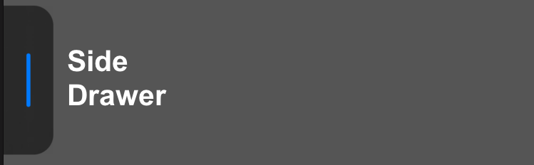
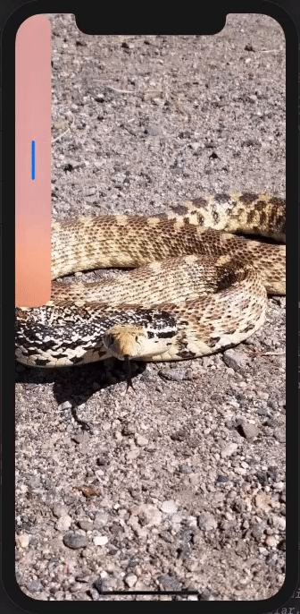
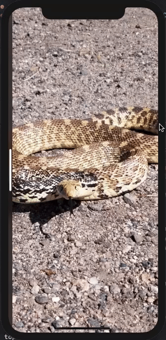
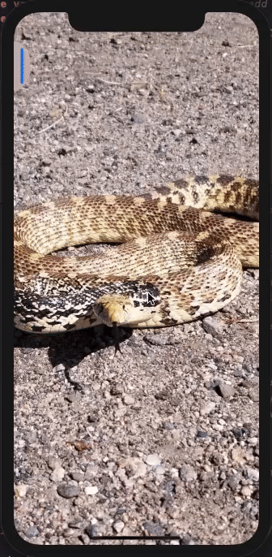
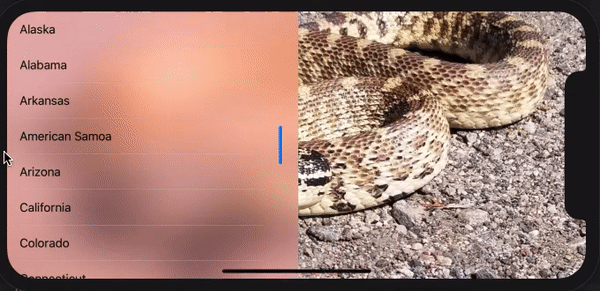
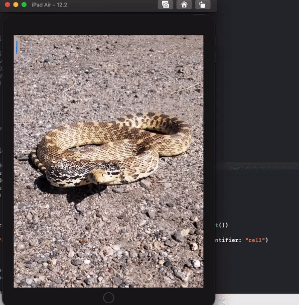

# SideDrawerView

[]()
[]()
[]()




### Drop a star ⭐ if you like this project or want to see updates in future, also go check out and leave a star on the orignial repo.

# ✍️ About This Repo

Side Drawer View is a fork from jvirus's  [draw-view](https://github.com/jVirus/drawer-view).  Shout out to jvirus for some awesome code!

This project is still in a work in progress and contribution is welcome. Check out the project boards for some TODO's.


### Limitations
- Drawer will open to the full width of the superview or trailing safeArea.
- Drawer is limited to the leading edge of the screen.


# 🏗 Installation
## CocoaPods
`SideDrawerView` is available via `CocoaPods`

```
pod 'SideDrawerView', '~> 1.0.0'
```
## Manual
You can always use `copy-paste` the sources method. Or you can compile the framework and include it with your project.

# 📺 Demo
Please wait while the `.gif` files are loading...

<p float="left">
  
  
  
</p>

<p float="left">
  
  
  
</p>

<p align="center">
    
    
</p>

# 🍱 Features

- **Easy to use**
  - You only need to instantiate a class called `SideDrawerView`.
- **Flexible `API`**
  - Includes a number of customizations and layout parameters that allows the `SideDrawerView` to have different characteristics.
- **Behavior**
    -  Flip height and width on orientation changes. 
    - Ability to close on rotation.
    - Haptic feedback can be triggered on state change. 
    - Top, leading and trailing safe areas can be used. Top safe area can be used separately from leading and trailing.
- **Callbacks**
  - You can use built-in callbacks in order to integrate animations or get the state/orientation changes.
- **SubView**
  - You can simply add your  `UI` component within the drawer by passing your view into `SideDrawerView.setContentView(view: UIView)` this will set auto constraints for your view. Check out the demo some examples.


# 📚 Code Samples

## Instantiation


The most simple instantiation: you only need to provide the `superview`:

```swift
let _ = SideDrawerView(superView: view)
```

Instantiation with all of the parameters; grouped into three for simplity :

```swift

let _ = SideDrawerView(drawerHandleWidth: 25,
                       drawerHeight: 50,
                       flipHeightWidthOnRotation: true,

                       useSafeAreaLayoutGuide: true,
                       useTopSafeArea: true,
                       setContentInSafeArea: true,

                       blurStyle: UIBlurEffect.Style.regular,
                       lineArrow: (20, 4, UIColor.systemBlue),
                       drawerBackgroundColor: .clear,

                       superView: view)
```

### Layouts
- **`drawerHandleWidth`**
    
    The width of the touch area that controllers the view, also the width when the drawer is closed.
        
- **`drawerHeight`**
    
    Height of the drawer. If `flipHeightWidthOnRotation` is `true` drawerHeight will become the width.
        
- **`flipHeightWidthOnRotation`**
        
    Flips the height and width in landscape mode.

### Constraints

- **`setDrawerHandleSafeArea`**
        
    Sets DrawerHandle open and close positions within the safe area.
    
- **`useTopSafeArea`**
        
    Sets SideDrawer top constraint to superview top safe area.
    
- **`setContentInSafeArea`**
    
    Sets `contentView` top, leading and trailing constraint to superview safe area.
    
### Colors & Styles

- **`blurStyle`**
    
    Style of drawer blur effect.
    
- **`lineArrow`**
    
    Tuple styling the lineArrow. `(height:CGFloat, width:CGFloat, color:UIColor) `
    
- **`drawerBackgroundColor`**
    
    Background color of the drawer.

## Properties & Methods

You can change the behavior of the component when a device is rotated. By default the `SideDrawerView` will not be closed when a device is rotated. However, you can change this behavior:
```swift
drawerView.closeOnRotation = true
```

You can programmatically change the state of the component:
```swift
drawerView.change(state: .open, shouldAnimate: true)
```


There is an animation & orientation closure that is used to change external components alongside with the `SideDrawerView`:
```swift

drawerView.animationClosure = { state in
    switch state {
    case .open:
      someOtherView.alpha = 1.0
    case .closed:
      someOtherView.alpha = 0.0
  }
}

drawerView.onOrientaitonChange = { orientaiton in
        switch orientaiton {
        case .portrait:
            stackView.axis = .horizontal
        case .portraitUpsideDown:
            stackView.axis = .horizontal
        case .landscapeLeft:
            stackView.axis = .vertical
        case .landscapeRight:
            stackView.axis = .vertical
        @unknown default:
            return
        }
  }

```

You can optionally specify a completion closure that gets called when animation is completed:
```swift
drawerView.completionClosure = { state in
  switch state {
    case .open:
      service.launch()
    case .closed:
      service.dismiss()
    }
}
```


The third and final callback closure can be used to get `SideDrawerView`state changes:
```swift
drawerView.onStateChangeClosure = { state in
  state == .closed ? showDialog() : doNothing()
}
```

## Other settable properties

Also there are many other properties that be customized:
```swift
drawerView.cornerRadius = 60
drawerView.animationDuration = 2.5
drawerView.animationDampingRatio = 0.9
drawerView.shadowRadius = 0.25
drawerView.shadowOpacity = 0.132
```

# 👨‍💻 Author

Fork Author [Mitchell Tucker] ()

Orignal Author [Astemir Eleev](https://github.com/jVirus)

# 🔖 Licence
The project is available under [MIT licence](https://github.com/jVirus/drawer-view/blob/master/LICENSE)
